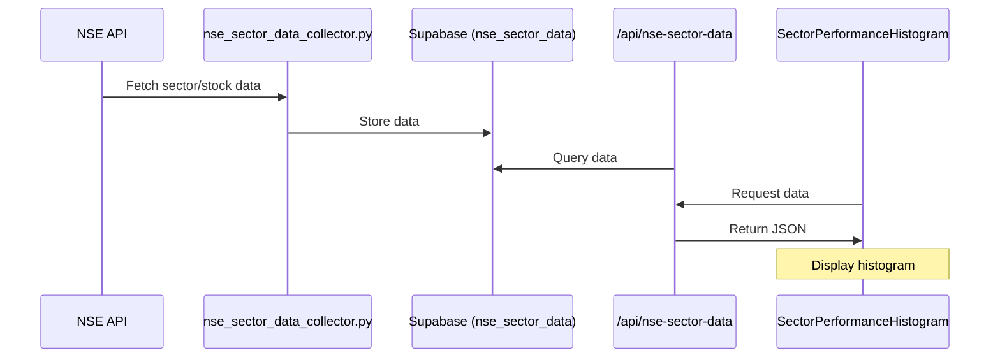
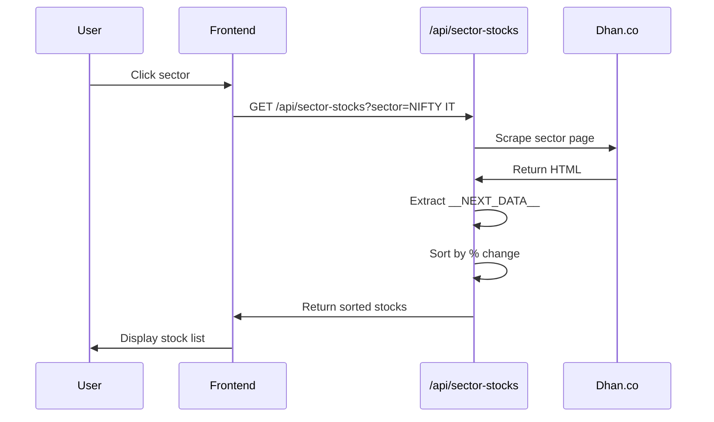

# Data Flows

## Sector Performance Display



### Steps

1. **NSE API** provides sector and stock data
2. **Python script** fetches and processes
3. **Supabase** stores in `nse_sector_data` table
4. **API route** reads from database
5. **React context** provides to components
6. **Component** displays histogram

## Stock Drill-Down

When user clicks a sector:



## Futures Analysis (Real-time)

```mermaid
graph TB
    A[VPS Cron Job<br/>Every 5 min] --> B[futures_analyzer.py]
    B --> C[NSE Derivatives API]
    C --> D[Fetch OI + Price Data]
    D --> E[Analyze Patterns]
    E --> F[Detect Buildup Type]
    F --> G[Generate Signals]
    G --> H[Store in futures_analysis]
    H --> I[/api/futures-analysis]
    I --> J[FNO Page]
```

## Update Schedule Summary

| Component | Frequency | Method |
|-----------|-----------|--------|
| Sector Performance | Every 1 minute | Background refresh (SectorDataContext) |
| Stock Drill-Down | On-demand | User click → API scrape |
| Futures Analysis | Every 5 minutes | VPS cron job |
| Option Analysis | Every 5 minutes | VPS cron job |
| Momentum Stocks | Daily at 3 PM IST | VPS cron job |
| Dhan Indices Config | Daily / On-demand | Manual script run |

:::tip Caching
Consider implementing caching layers to reduce API calls and improve performance.
:::
