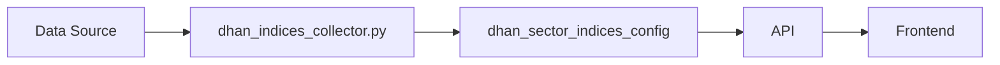

# dhan_sector_indices_config

Supabase Dhan Python

## Purpose

Stores 119 NSE indices metadata from Dhan including SEC_ID for historical data API.

## Data Flow

Dhan.co → dhan_indices_collector.py → dhan_sector_indices_config table

## Update Frequency

**Daily or on-demand**

## Key Columns

- `sec_id: Required for Dhan historical data API calls`\n- `symbol: Trading symbol (e.g., 'NIFTY PHARMA')`\n- `display_symbol: Human-readable name`\n- `ltp: Last traded price`\n- `high_1yr, low_1yr: 52-week range`

## Used By

Historical data API calls

## Related Script

See [dhan_indices_collector.py](/scripts/dhan_indices_collector) for implementation details.

:::warning Important
SEC_ID is critical for POST https://openweb-ticks.dhan.co/getDataH API calls
:::

