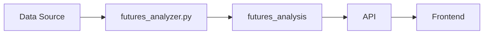

# futures_analysis

Supabase NSE API Python

## Purpose

Real-time futures analysis with OI buildup patterns and signals.

## Data Flow

NSE Derivatives API → futures_analyzer.py (VPS) → futures_analysis table → /api/futures-analysis

## Update Frequency

**Every 5 minutes during market hours**

## Key Columns

- `symbol: Stock/Index symbol`\n- `oi_buildup_type: LONG_BUILDUP, SHORT_BUILDUP, etc.`\n- `basis: Futures premium/discount`\n- `signal_type: BULLISH, BEARISH, NEUTRAL`

## Used By

FNO Futures Analysis page

## Related Script

See [futures_analyzer.py](/scripts/futures_analyzer) for implementation details.

