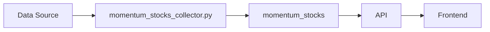

# momentum_stocks

Supabase Dhan Python

## Purpose

Daily snapshot of high-momentum stocks with fundamental metrics.

## Data Flow

Dhan Momentum API → momentum_stocks_collector.py → momentum_stocks table → /api/momentum-stocks

## Update Frequency

**Daily at 3:00 PM IST**

## Key Columns

- `symbol: Stock symbol`\n- `market_cap: Market cap in crores`\n- `price_change_1month, price_change_1year: Performance`\n- `roce, roe: Return metrics`\n- `eps_growth_1year: Growth metrics`

## Used By

Market momentum display

## Related Script

See [momentum_stocks_collector.py](/scripts/momentum_stocks_collector) for implementation details.

