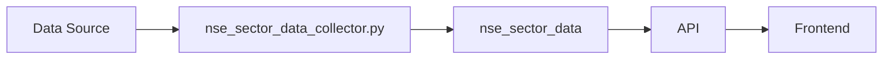

# nse_sector_data

Supabase NSE API Python

## Purpose

Main table for sector performance - stores NSE sector indices and their constituent stocks.

## Data Flow

NSE API → nse_sector_data_collector.py → nse_sector_data table → /api/nse-sector-data → UI

## Update Frequency

**On-demand via API calls, background refresh every 1 minute**

## Key Columns

- `data_type: 'INDEX' or 'STOCK'`\n- `index_name: e.g., 'NIFTY IT', 'NIFTY AUTO'`\n- `symbol: Stock/Index symbol`\n- `current_price, day_change_percent: Price data`\n- `advances, declines: Market breadth (INDEX only)`

## Used By

SectorPerformanceHistogram, Market Breadth display

## Related Script

See [nse_sector_data_collector.py](/scripts/nse_sector_data_collector) for implementation details.

