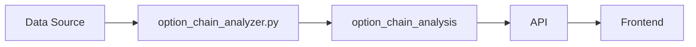

# option_chain_analysis

Supabase NSE API Python

## Purpose

Institutional sentiment from option chain (PCR, max pain, unusual activity).

## Data Flow

NSE Option Chain API → option_chain_analyzer.py (VPS) → option_chain_analysis table → /api/option-chain-analysis

## Update Frequency

**Every 5 minutes during market hours**

## Key Columns

- `overall_pcr: Put-Call Ratio`\n- `max_pain: Max pain strike price`\n- `net_call_buildup, net_put_buildup: OI buildup`\n- `institutional_sentiment: Overall sentiment`

## Used By

FNO Option Analysis page

## Related Script

See [option_chain_analyzer.py](/scripts/option_chain_analyzer) for implementation details.

