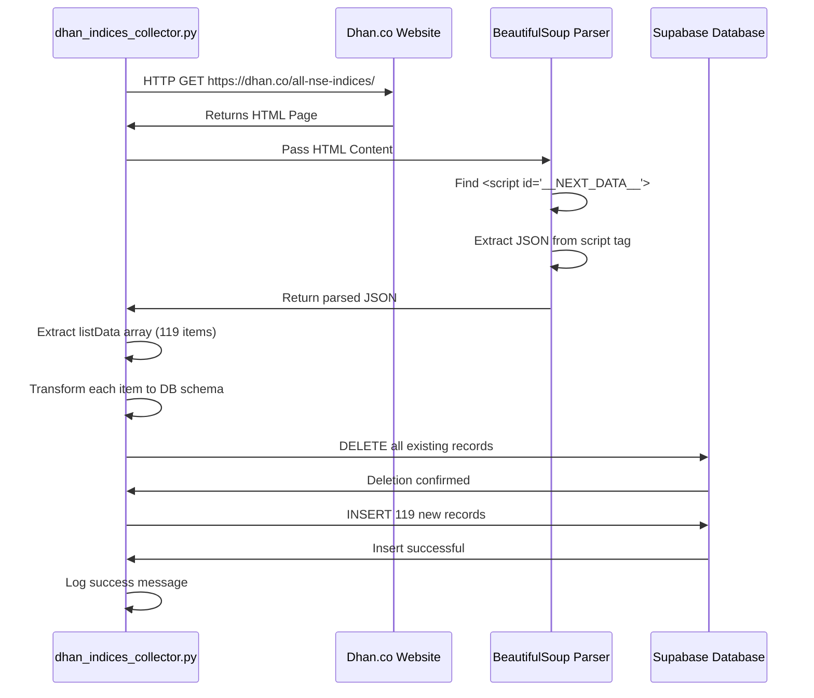

# Dhan Indices Collector

## What This Script Does

The `dhan_indices_collector.py` script performs the following operations:

1. **Scrapes** the Dhan.co website to fetch metadata for 119 NSE indices
2. **Parses** embedded JSON data from the HTML page
3. **Transforms** the data structure from Dhan's format to our database schema
4. **Deletes** all existing records in the database (to ensure fresh data)
5. **Inserts** all 119 indices as new records into Supabase

### Why This Script Exists

The primary purpose is to collect **SEC_ID** (Security ID) values for each index. This SEC_ID is absolutely critical because it's required to make API calls to Dhan's historical data endpoint, which provides OHLCV (Open, High, Low, Close, Volume) data.

Without SEC_ID, we cannot fetch historical price data for calculating 7D, 30D, 90D, and 52W percentage changes.

## Complete Process Flow



## Database Table Used

### Table Name
`dhan_sector_indices_config`

### Purpose
Stores configuration and metadata for all NSE indices scraped from Dhan, including the critical SEC_ID needed for historical data API calls.

### Location of DDL
The DDL (Data Definition Language) file is located at:

```
database/schemas/dhan-sector-indices-config-schema.sql
```

## Complete Table Schema

Here is the full schema definition:

```sql
CREATE TABLE IF NOT EXISTS dhan_sector_indices_config (
    id BIGSERIAL PRIMARY KEY,
    
    -- Symbol Information
    symbol TEXT NOT NULL UNIQUE,
    display_symbol TEXT NOT NULL,
    seo_symbol TEXT,
    
    -- IDs and Classification
    sec_id INTEGER NOT NULL UNIQUE,
    exchange TEXT,
    segment TEXT,
    instrument TEXT,
    index_based_on_exch TEXT,
    
    -- Price Information
    ltp NUMERIC(12, 2),
    high_1yr NUMERIC(12, 2),
    low_1yr NUMERIC(12, 2),
    
    -- Performance Metrics
    price_perchng_1year NUMERIC(10, 4),
    price_perchng_3year NUMERIC(10, 4),
    price_perchng_5year NUMERIC(10, 4),
    
    -- Trading Information
    tick_size NUMERIC(10, 4),
    
    -- Metadata
    updated_at TIMESTAMPTZ DEFAULT NOW(),
    created_at TIMESTAMPTZ DEFAULT NOW()
);

-- Indexes for Performance
CREATE INDEX idx_dhan_indices_symbol ON dhan_sector_indices_config(symbol);
CREATE INDEX idx_dhan_indices_sec_id ON dhan_sector_indices_config(sec_id);
CREATE INDEX idx_dhan_indices_seo_symbol ON dhan_sector_indices_config(seo_symbol);
CREATE INDEX idx_dhan_indices_exchange ON dhan_sector_indices_config(exchange);
CREATE INDEX idx_dhan_indices_updated_at ON dhan_sector_indices_config(updated_at DESC);
```

### Column Descriptions

| Column Name | Data Type | Constraints | Description | Example Value |
|-------------|-----------|-------------|-------------|---------------|
| `id` | BIGSERIAL | PRIMARY KEY | Auto-incrementing ID | 1, 2, 3... |
| `symbol` | TEXT | NOT NULL, UNIQUE | Trading symbol | "NIFTY PHARMA" |
| `display_symbol` | TEXT | NOT NULL | Human-readable display name | "Nifty Pharma" |
| `seo_symbol` | TEXT | - | SEO-friendly URL slug | "nifty-pharma" |
| `sec_id` | INTEGER | NOT NULL, UNIQUE | **Dhan Security ID (Critical!)** | 32 |
| `exchange` | TEXT | - | Exchange code | "IDX", "NSE" |
| `segment` | TEXT | - | Market segment | "I" (Index) |
| `instrument` | TEXT | - | Instrument type | "IDX" |
| `index_based_on_exch` | TEXT | - | Base exchange | "NSE" |
| `ltp` | NUMERIC(12,2) | - | Last Traded Price | 22500.50 |
| `high_1yr` | NUMERIC(12,2) | - | 52-week high price | 24000.00 |
| `low_1yr` | NUMERIC(12,2) | - | 52-week low price | 20000.00 |
| `price_perchng_1year` | NUMERIC(10,4) | - | 1-year percentage change | 12.5000 |
| `price_perchng_3year` | NUMERIC(10,4) | - | 3-year percentage change | 45.2300 |
| `price_perchng_5year` | NUMERIC(10,4) | - | 5-year percentage change | 94.4215 |
| `tick_size` | NUMERIC(10,4) | - | Minimum price movement | 0.05 |
| `updated_at` | TIMESTAMPTZ | DEFAULT NOW() | Last update timestamp | 2024-12-20 14:30:00+00 |
| `created_at` | TIMESTAMPTZ | DEFAULT NOW() | Record creation timestamp | 2024-12-20 14:30:00+00 |

### Important Note on sec_id

The `sec_id` column is the **most critical** piece of data. This is Dhan's internal security identifier and is required for all historical data API calls. Without it, you cannot fetch OHLCV data.

## API Used

### API Endpoint

```
https://dhan.co/all-nse-indices/
```

### Request Method
`GET`

### Request Type
**Web Scraping** (not a REST API)

This is an HTML page that needs to be parsed to extract embedded JSON data.

### HTTP Headers Used

```python
headers = {
    'User-Agent': 'Mozilla/5.0 (Macintosh; Intel Mac OS X 10_15_7) AppleWebKit/537.36 (KHTML, like Gecko) Chrome/142.0.0.0 Safari/537.36',
    'Accept': 'text/html,application/xhtml+xml,application/xml;q=0.9,*/*;q=0.8',
    'Accept-Language': 'en-GB,en;q=0.9'
}
```

These headers make the request appear like it's coming from a regular web browser.

## API Response Structure

### Response Format

The endpoint returns an HTML page (not JSON). The data we need is embedded inside a `<script>` tag within the HTML.

### HTML Structure

```html
<!DOCTYPE html>
<html>
  <head>...</head>
  <body>
    <div id="__next">
      <!-- Page content -->
    </div>
    
    <!-- THE DATA WE NEED IS HERE -->
    <script id="__NEXT_DATA__" type="application/json">
    {
      "props": {
        "pageProps": {
          "listData": [
            {
              "DispSym": "Gift Nifty",
              "Exch": "IDX",
              "High1Yr": 26565,
              "IndexBasedOnExch": "NSE",
              "Inst": "IDX",
              "Low1Yr": 21827,
              "Ltp": 25862,
              "PricePerchng1year": 6.6915,
              "PricePerchng3year": 40.3183,
              "PricePerchng5year": 94.4215,
              "Seg": "I",
              "Seosym": "gift-nifty",
              "Sid": 5024,
              "Sym": "GIFTNIFTY",
              "TickSize": 0
            },
            // ... 118 more indices
          ]
        }
      }
    }
    </script>
  </body>
</html>
```

### JSON Data Structure

The JSON inside `__NEXT_DATA__` has this structure:

```json
{
  "props": {
    "pageProps": {
      "listData": [
        {
          "DispSym": "Gift Nifty",
          "Exch": "IDX",
          "High1Yr": 26565,
          "IndexBasedOnExch": "NSE",
          "Inst": "IDX",
          "Low1Yr": 21827,
          "Ltp": 25862,
          "PricePerchng1year": 6.6915,
          "PricePerchng3year": 40.3183,
          "PricePerchng5year": 94.4215,
          "Seg": "I",
          "Seosym": "gift-nifty",
          "Sid": 5024,
          "Sym": "GIFTNIFTY",
          "TickSize": 0
        }
      ]
    }
  },
  "page": "/all-nse-indices",
  "query": {},
  "buildId": "...",
  "isFallback": false
}
```

The data we need is in: `data.props.pageProps.listData`

This array contains 119 objects, one for each index.

## How We Parse the Response

### Step 1: Fetch HTML

```python
response = self.session.get(url, timeout=30)
response.raise_for_status()
html_content = response.text
```

### Step 2: Parse HTML with BeautifulSoup

```python
from bs4 import BeautifulSoup

soup = BeautifulSoup(response.text, 'html.parser')
```

### Step 3: Find the Script Tag

```python
next_data_script = soup.find('script', {'id': '__NEXT_DATA__'})
```

This finds: `<script id="__NEXT_DATA__" type="application/json">...</script>`

### Step 4: Extract JSON String

```python
json_string = next_data_script.string
```

This extracts the text content between the script tags.

### Step 5: Parse JSON

```python
import json

data = json.loads(json_string)
```

This converts the JSON string into a Python dictionary.

### Step 6: Navigate to Data

```python
indices_list = data.get('props', {}).get('pageProps', {}).get('listData', [])
```

This safely extracts the array: `data["props"]["pageProps"]["listData"]`

### Step 7: Transform Each Item

For each item in the indices_list, we transform it:

```python
for index_data in indices_list:
    record = {
        'symbol': index_data.get('Sym'),
        'display_symbol': index_data.get('DispSym'),
        'seo_symbol': index_data.get('Seosym'),
        'sec_id': index_data.get('Sid'),
        'exchange': index_data.get('Exch'),
        'segment': index_data.get('Seg'),
        'instrument': index_data.get('Inst'),
        'index_based_on_exch': index_data.get('IndexBasedOnExch'),
        'ltp': index_data.get('Ltp'),
        'high_1yr': index_data.get('High1Yr'),
        'low_1yr': index_data.get('Low1Yr'),
        'price_perchng_1year': index_data.get('PricePerchng1year'),
        'price_perchng_3year': index_data.get('PricePerchng3year'),
        'price_perchng_5year': index_data.get('PricePerchng5year'),
        'tick_size': index_data.get('TickSize'),
        'updated_at': datetime.now(timezone.utc).isoformat()
    }
```

### Field Mapping Table

| Dhan API Field | Database Column | Description |
|----------------|-----------------|-------------|
| `Sym` | `symbol` | Trading symbol |
| `DispSym` | `display_symbol` | Display name |
| `Seosym` | `seo_symbol` | SEO symbol |
| `Sid` | `sec_id` | **Security ID** |
| `Exch` | `exchange` | Exchange code |
| `Seg` | `segment` | Market segment |
| `Inst` | `instrument` | Instrument type |
| `IndexBasedOnExch` | `index_based_on_exch` | Base exchange |
| `Ltp` | `ltp` | Last price |
| `High1Yr` | `high_1yr` | 52-week high |
| `Low1Yr` | `low_1yr` | 52-week low |
| `PricePerchng1year` | `price_perchng_1year` | 1-year change |
| `PricePerchng3year` | `price_perchng_3year` | 3-year change |
| `PricePerchng5year` | `price_perchng_5year` | 5-year change |
| `TickSize` | `tick_size` | Tick size |

### Example Transformation

**Input (from Dhan API):**
```json
{
  "Sym": "NIFTY PHARMA",
  "DispSym": "Nifty Pharma",
  "Seosym": "nifty-pharma",
  "Sid": 32,
  "Exch": "IDX",
  "Seg": "I",
  "Inst": "IDX",
  "IndexBasedOnExch": "NSE",
  "Ltp": 22500.50,
  "High1Yr": 24000.00,
  "Low1Yr": 20000.00,
  "PricePerchng1year": 12.5,
  "PricePerchng3year": 35.2,
  "PricePerchng5year": 65.8,
  "TickSize": 0.05
}
```

**Output (to Database):**
```python
{
  "symbol": "NIFTY PHARMA",
  "display_symbol": "Nifty Pharma",
  "seo_symbol": "nifty-pharma",
  "sec_id": 32,
  "exchange": "IDX",
  "segment": "I",
  "instrument": "IDX",
  "index_based_on_exch": "NSE",
  "ltp": 22500.50,
  "high_1yr": 24000.00,
  "low_1yr": 20000.00,
  "price_perchng_1year": 12.5,
  "price_perchng_3year": 35.2,
  "price_perchng_5year": 65.8,
  "tick_size": 0.05,
  "updated_at": "2024-12-20T14:30:00+00:00"
}
```

## Usage

### Prerequisites

1. **Create the Supabase table:**

Run the SQL in `database/schemas/dhan-sector-indices-config-schema.sql`

2. **Install dependencies:**

```bash
pip install requests beautifulsoup4
```

3. **Activate virtual environment:**

```bash
source myenv/bin/activate
```

### Run the Script

```bash
python3 scripts/dhan_indices_collector.py
```

### Expected Console Output

```
2024-12-20T14:30:00Z INFO Starting Dhan Indices Collector
2024-12-20T14:30:00Z INFO Fetching data from https://dhan.co/all-nse-indices/
2024-12-20T14:30:02Z INFO Successfully fetched 119 indices
2024-12-20T14:30:02Z INFO Deleting existing records...
2024-12-20T14:30:03Z INFO Inserting 119 records...
2024-12-20T14:30:04Z INFO Successfully stored 119 indices in Supabase
2024-12-20T14:30:04Z INFO Data collection and storage completed successfully
2024-12-20T14:30:04Z INFO ✅ Dhan indices data collection completed successfully
```

## Sample Data After Insertion

After running the script, your table will contain 119 records like:

| id | symbol | sec_id | display_symbol | ltp | high_1yr | low_1yr | price_perchng_1year |
|----|--------|--------|----------------|-----|----------|---------|---------------------|
| 1 | GIFTNIFTY | 5024 | Gift Nifty | 25862.00 | 26565.00 | 21827.00 | 6.6915 |
| 2 | NIFTY PHARMA | 32 | Nifty Pharma | 22500.50 | 24000.00 | 20000.00 | 12.5000 |
| 3 | NIFTY AUTO | 14 | Nifty Auto | 18500.00 | 19200.00 | 16800.00 | 8.3000 |

## Critical Use Case: SEC_ID for Historical Data

### Query to Get SEC_ID

```sql
SELECT sec_id, symbol, display_symbol 
FROM dhan_sector_indices_config 
WHERE symbol = 'NIFTY PHARMA';
```

**Result:**
```
 sec_id |    symbol     | display_symbol 
--------+---------------+----------------
     32 | NIFTY PHARMA  | Nifty Pharma
```

### Using SEC_ID in Historical Data API

Once you have the SEC_ID, you can fetch historical OHLCV data:

```bash
curl -X POST 'https://openweb-ticks.dhan.co/getDataH' \
  -H 'Content-Type: application/json' \
  -d '{
    "EXCH": "NSE",
    "SYM": "NIFTY PHARMA",
    "SEG": "E",
    "INST": "INDEX",
    "SEC_ID": 32,
    "START": 1750617000,
    "END": 1766215131,
    "INTERVAL": "D"
  }'
```

This returns daily OHLCV data which can be used to calculate 7D, 30D, 90D, and 52W percentage changes.

## Error Handling

The script includes comprehensive error handling:

### Network Errors
- Connection timeouts
- DNS resolution failures
- HTTP errors (404, 500, etc.)

### Parsing Errors
- Missing `__NEXT_DATA__` script tag
- Invalid JSON in script tag
- Unexpected data structure

### Database Errors
- Connection failures
- Insert/delete failures
- Constraint violations

All errors are logged with timestamps for debugging.

## Scheduling Recommendations

**Recommended frequency:** Daily or on-demand

The data doesn't change frequently (mostly price updates), so daily runs are sufficient.

### Cron Job Example

```bash
# Run daily at 6:00 AM
0 6 * * * cd /path/to/project && source myenv/bin/activate && python3 scripts/dhan_indices_collector.py >> logs/dhan_indices.log 2>&1
```

## Important Notes

:::warning Web Scraping Considerations
This script uses web scraping, which may be detectable. Consider:
- Adding random delays between requests (1-3 seconds)
- Rotating user agents
- Implementing caching to reduce request frequency
- Checking Dhan's robots.txt and terms of service
- Moving to official APIs if they become available
:::

:::tip Alternative Approach
For production use, consider using NSE's official APIs or other authorized data sources instead of web scraping.
:::

## Related Documentation

- [Database Schema Details](/database/dhan_sector_indices_config)
- [Historical Data API Usage](/data-sources/overview#dhan-historical-data-api)
- [Script Source Code](https://github.com/your-repo/scripts/dhan_indices_collector.py)
