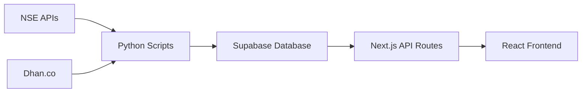

# TradeSmartMoney System Documentation

Welcome to the TradeSmartMoney technical documentation. This guide covers all database tables, Python scripts, data sources, and data flows.

## System Architecture



### Tech Stack

- **Frontend**: Next.js 14, React, TypeScript, Tailwind CSS
- **Backend**: Next.js API Routes (Serverless)
- **Database**: Supabase - `https://ejnuocizpsfcobhyxgrd.supabase.co`
- **Data Collectors**: Python scripts (VPS/Scheduled)
- **Data Sources**: NSE APIs, Dhan.co

## Quick Links

- [Database Tables](/database/overview) - All Supabase tables
- [Python Scripts](/scripts/overview) - Data collection scripts
- [Data Sources](/data-sources/overview) - APIs and scraping sources
- [Data Flows](/data-flows) - How data moves through the system

## Last Updated

2024-12-20

:::tip How to Update
Edit `documentation-data.json` and run:
```bash
python3 scripts/generate_docusaurus_docs.py
```
:::
