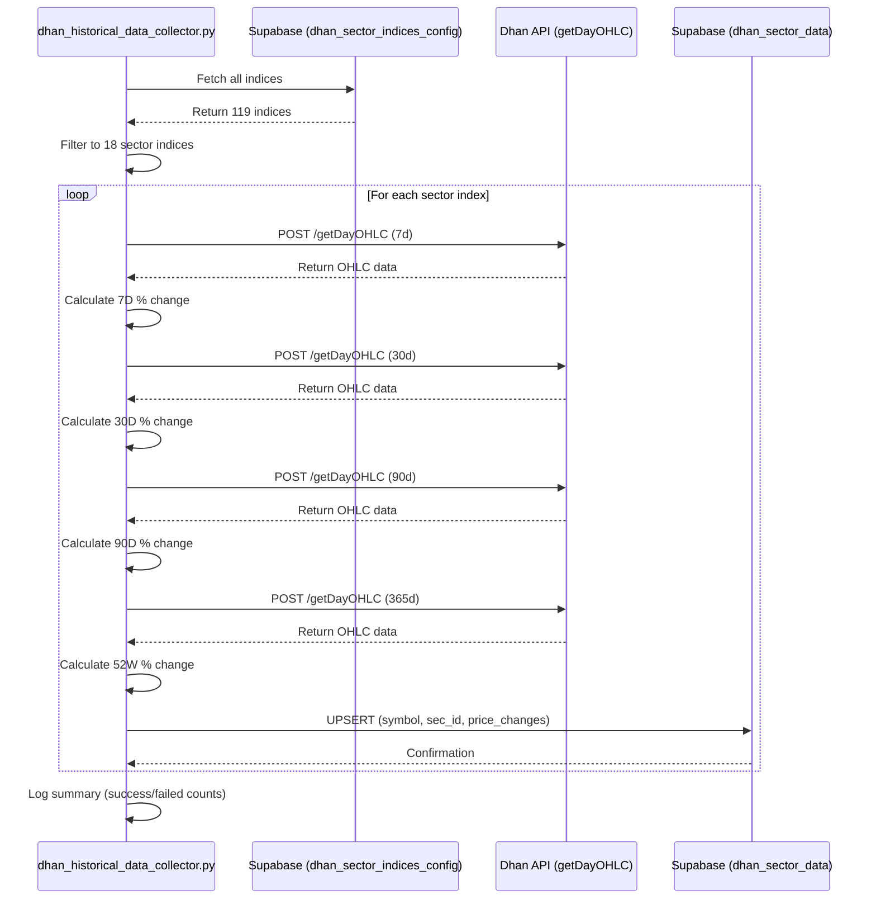

# Dhan Historical Data Collector

## Overview

The `dhan_historical_data_collector.py` script fetches historical OHLC (Open, High, Low, Close) data from Dhan API and calculates percentage price changes for sector indices over different time periods (7D, 30D, 90D, 52W).

**Location**: `/scripts/dhan_historical_data_collector.py`

## Purpose

- Fetches historical price data for **7D, 30D, 90D, and 52W** time periods
- Calculates percentage price changes using OHLC data
- Stores calculated changes in `dhan_sector_data` Supabase table
- Powers the time range buttons (7D, 30D, 90D, 52W) in the **Sector Performance** UI widget

## Scope

This script **only processes indices** that are displayed in the **Sector Performance** widget on the left sidebar:

- NIFTY 50
- NIFTY BANK
- NIFTY IT
- NIFTY PHARMA
- NIFTY AUTO
- NIFTY FMCG
- NIFTY METAL
- NIFTY REALTY
- NIFTY ENERGY
- NIFTY MEDIA
- NIFTY PSU BANK
- NIFTY OIL AND GAS
- NIFTY PRIVATE BANK
- NIFTY INFRASTRUCTURE
- NIFTY HEALTHCARE
- NIFTY CONSUMER DURABLES
- NIFTY INDIA CONSUMPTION
- Nifty Fin Service (Finnifty)

**Total**: 18 sector indices (filtered from 119 total indices in `dhan_sector_indices_config`)

## Database Tables

### Source Table: `dhan_sector_indices_config`

The script reads SEC_ID and symbol information from this table.

**Columns Used**:
- `sec_id` - Security ID required for Dhan API calls
- `symbol` - Index trading symbol
- `display_symbol` - Display name for filtering

### Target Table: `dhan_sector_data`

The script stores calculated price changes in this table.

| Column | Type | Description |
|--------|------|-------------|
| `id` | BIGSERIAL | Primary key |
| `symbol` | TEXT | Index symbol (e.g., 'NIFTY 50') - UNIQUE |
| `sec_id` | INTEGER | Security ID from Dhan |
| `price_change_7d` | DECIMAL(8,3) | 7-day price % change |
| `price_change_30d` | DECIMAL(8,3) | 30-day price % change |
| `price_change_90d` | DECIMAL(8,3) | 90-day price % change |
| `price_change_52w` | DECIMAL(8,3) | 52-week price % change |
| `current_price` | DECIMAL(12,2) | Latest closing price |
| `updated_at` | TIMESTAMPTZ | Last update timestamp |
| `created_at` | TIMESTAMPTZ | Record creation timestamp |

**DDL Location**: `/database/schemas/dhan-sector-data-schema.sql`

**Indexes**:
- `idx_dhan_sector_data_symbol` - On `symbol` column
- `idx_dhan_sector_data_sec_id` - On `sec_id` column
- `idx_dhan_sector_data_7d` - On `price_change_7d` column
- `idx_dhan_sector_data_30d` - On `price_change_30d` column
- `idx_dhan_sector_data_90d` - On `price_change_90d` column
- `idx_dhan_sector_data_52w` - On `price_change_52w` column
- `idx_dhan_sector_data_updated_at` - On `updated_at` column

## API Details

### Endpoint

```
POST https://openweb-ticks.dhan.co/getDayOHLC
```

### Request Format

```json
{
  "EXCH": "IDX",
  "SEG": "I",
  "INST": "IDX",
  "SEC_ID": 447,
  "DURATION": "7d",
  "Delay": true,
  "Delayby": 15
}
```

### Response Format

```json
{
  "success": true,
  "data": {
    "o": [23450.5, 23500.0, 23550.0],
    "h": [23600.0, 23650.0, 23700.0],
    "l": [23400.0, 23450.0, 23500.0],
    "c": [23550.0, 23600.0, 23650.0],
    "v": [1000000, 1200000, 1150000],
    "t": [1750617000, 1750703400]
  }
}
```

### Response Parsing

The script extracts the **closing prices array** from the response and uses first and last values to calculate change.

## Calculation Logic

### Price Change Formula

```python
price_change = ((last_close - first_close) / first_close) * 100
```

### Example Calculation

If **7 days ago** NIFTY 50 closed at **₹23,500** and **today** it closed at **₹24,000**:

```python
price_change_7d = ((24000 - 23500) / 23500) * 100 = 2.13%
```

### Duration Mapping

| UI Button | Script Key | API Duration | Explanation |
|-----------|------------|--------------|-------------|
| 7D | `7d` | `7d` | Last 7 days |
| 30D | `30d` | `30d` | Last 30 days |
| 90D | `90d` | `90d` | Last 90 days |
| 52W | `52w` | `365d` | Last 365 days |

## Process Flow



## Usage

### Run for All Sector Indices

```bash
cd /Users/ashinde/Workspace/saas/tradesmartmoney
python3 scripts/dhan_historical_data_collector.py
```

This will process all **18 sector indices**.

### Test Mode (Limited Indices)

```bash
# Process only first 3 indices
python3 scripts/dhan_historical_data_collector.py 3
```

## Features

- ✅ **Rate Limiting**: 1-second delay between API calls
- ✅ **Error Handling**: Graceful handling of API failures
- ✅ **Detailed Logging**: Comprehensive progress logging
- ✅ **Upsert Logic**: Updates existing or inserts new records
- ✅ **Test Mode**: Command line argument for limiting indices
- ✅ **Filtering**: Only processes UI-displayed indices

## Scheduling Recommendations

Run this script daily at market close:

```bash
# Cron job: Daily at 4:00 PM IST (after market closes)
0 16 * * 1-5 cd /path/to/tradesmartmoney && python3 scripts/dhan_historical_data_collector.py >> logs/dhan_historical.log 2>&1
```

## Error Handling

| Error Type | Handling Strategy |
|------------|-------------------|
| **API Failures** | Logs error, continues to next index |
| **Missing OHLC Data** | Skips calculation, logs warning |
| **Network Timeouts** | 30-second timeout, fails gracefully |
| **JSON Parse Errors** | Logs error and continues |

## Performance

- **Total Indices**: 18
- **API Calls per Index**: 4 (7d, 30d, 90d, 365d)
- **Total API Calls**: 72
- **Estimated Duration**: ~72-90 seconds per run
