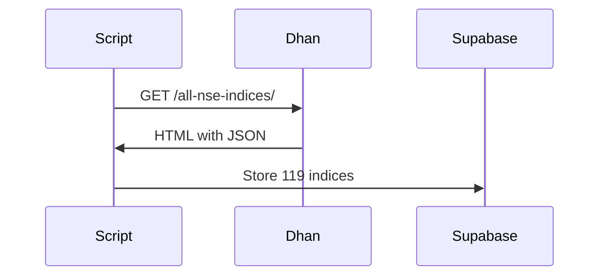

# dhan_indices_collector.py

Scrapes **119 NSE indices** from Dhan.co and stores in `dhan_sector_indices_config`.

**Critical Data**: **SEC_ID** - Required for historical OHLCV API calls.

## Process Flow



## Database Table

**Table**: `dhan_sector_indices_config`

**Schema**: `database/schemas/dhan-sector-indices-config-schema.sql`

## Key Columns

| Column | Description |
|--------|-------------|
| `sec_id` | Dhan Security ID (Critical!) |
| `symbol` | Trading symbol |
| `ltp` | Last price |

## API Used

**URL**: `https://dhan.co/all-nse-indices/`

**Method**: GET (Web Scraping)

Parses `__NEXT_DATA__` script tag containing JSON.

## Usage

```bash
python3 scripts/dhan_indices_collector.py
```

## Use Case

Query SEC_ID for historical API:

```sql
SELECT sec_id FROM dhan_sector_indices_config 
WHERE symbol = 'NIFTY PHARMA';
```

Then use in Dhan historical data API.

:::warning
Uses web scraping. Add delays between requests.
:::
